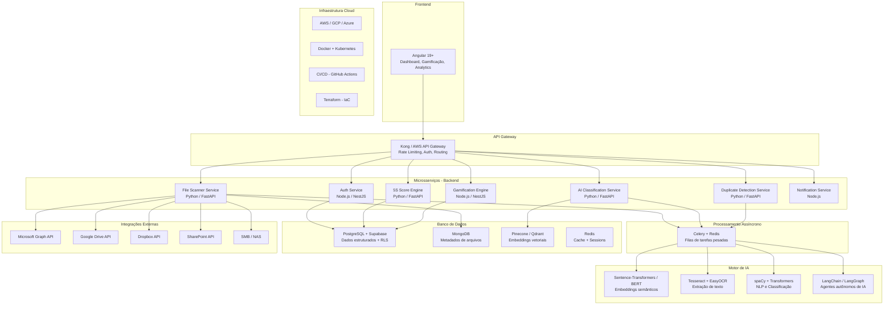

# 5S Digital — Plataforma SaaS de Governança e Organização Digital Corporativa

## Visão Geral

Após análise completa dos dois documentos de esboço fornecidos, este plano consolida todas as funcionalidades, tecnologias e arquitetura necessárias para desenvolver uma plataforma SaaS completa de **5S Digital Corporativo** — um produto que aplica a metodologia 5S (Seiri, Seiton, Seiso, Seiketsu, Shitsuke) ao ambiente digital das empresas.

> [!IMPORTANT]
> A plataforma **não armazena arquivos dos clientes**. Ela atua como um **orquestrador inteligente** que se conecta aos ambientes de armazenamento existentes (Google Drive, OneDrive, SharePoint, etc.) para analisar, classificar, organizar e manter a higiene digital de forma autônoma.

---

## 1. Módulos e Funcionalidades Completas

A plataforma será composta por **10 módulos principais**, cada um alinhado aos princípios da metodologia 5S, com funcionalidades que vão além do que os esboços originais propõem.

---

### 📁 Módulo 1 — Scanner de Ambiente Digital (Seiri)

O ponto de entrada da plataforma. Realiza a varredura completa do ecossistema de arquivos do cliente.

| Funcionalidade | Descrição |
|---|---|
| **Varredura Multi-Provedor** | Conexão simultânea com Google Drive, OneDrive, SharePoint, Dropbox, NAS e servidores SMB |
| **Mapeamento Topológico** | Cria o **Digital Twin** (gêmeo digital) da estrutura de arquivos da empresa |
| **Extração de Metadados** | Coleta nome, tipo, tamanho, data de criação/modificação, último acesso, proprietário |
| **Detecção de Anomalias** | Identifica arquivos vazios, atalhos quebrados, arquivos temporários, downloads esquecidos |
| **Análise de Profundidade** | Detecta pastas com excesso de subdiretórios ou arquivos soltos sem estrutura |
| **Relatório de Primeira Impressão** | Gera um diagnóstico visual imediato do caos digital em minutos |

---

### 🧠 Módulo 2 — Motor de IA e Classificação Inteligente (Seiri + Seiton)

O cérebro cognitivo da plataforma, responsável por compreender o conteúdo dos documentos.

| Funcionalidade | Descrição |
|---|---|
| **OCR Avançado** | Extração de texto de PDFs, imagens escaneadas, atas manuscritas e assinaturas |
| **Classificação Semântica por NLP** | IA identifica automaticamente: contratos, notas fiscais, boletos, relatórios, extratos, currículos |
| **Geração de Embeddings Vetoriais** | Cada documento é convertido em um vetor semântico (via BERT/Sentence-Transformers) para análise profunda |
| **Classificação por Conteúdo Visual** | Visão computacional identifica tabelas, layouts corporativos e logotipos |
| **Aprendizado Contínuo** | A IA aprende com o comportamento do usuário (ex: se sempre move NF → Financeiro, ela internaliza) |
| **Human-in-the-Loop** | Limiares de confiança algorítmica; sugestões abaixo do limiar requerem aprovação humana |

> [!TIP]
> **Tecnologia adicional recomendada**: Integrar **Agentes de IA Autônomos** (baseados em frameworks como LangChain/LangGraph/CrewAI) para orquestrar fluxos de classificação complexos que envolvem múltiplas etapas de decisão.

---

### 🔍 Módulo 3 — Deduplicação Semântica (Seiso)

Vai muito além de comparação por hash. Utiliza inteligência semântica para identificar duplicatas conceituais.

| Funcionalidade | Descrição |
|---|---|
| **Hash Criptográfico (MD5/SHA-256)** | Detecta duplicatas binárias idênticas (cópia exata) |
| **Deduplicação Semântica (SemDeDup)** | Identifica documentos com conteúdo equivalente mesmo com alterações (sinônimos, reordenação de parágrafos) |
| **Clustering Vetorial (k-means)** | Agrupa documentos semanticamente similares em clusters para análise eficiente |
| **Similaridade de Cosseno** | Calcula grau de concordância entre embeddings; threshold configurável por tenant |
| **Fusão Inteligente de E-mails** | Consolida threads de e-mail com anexos replicados, retendo apenas o exemplar representativo |
| **Detecção de Versões** | Identifica `Relatorio_v1`, `Relatorio_v2`, `Relatorio_Final` como versões do mesmo artefato |

---

### 📂 Módulo 4 — Organização Automática e Reorganização por IA (Seiton)

A funcionalidade mais impactante: a IA sugere e executa a reorganização completa do ambiente digital.

| Funcionalidade | Descrição |
|---|---|
| **Sugestão de Taxonomia Corporativa** | IA analisa o corpus documental e propõe a estrutura ideal de pastas baseada em padrões de mercado |
| **Templates Corporativos de Pastas** | Modelos pré-aprovados de estrutura (ex: `Financeiro → Contratos / NFs / Relatórios`) |
| **Simulação ANTES/DEPOIS** | Mostra o impacto da reorganização antes de aplicá-la (ex: duplicatas caem de 21% → 3%) |
| **Reorganização Automática com 1 Clique** | Botão "Aplicar reorganização" move e reestrutura milhares de arquivos de forma segura |
| **Método Copiar-e-Descartar** | Nunca usa "Recortar"; copia arquivos para a nova estrutura e só exclui a origem após validação |
| **Busca Semântica** | O usuário pesquisa "contrato ônibus 2024" e encontra o arquivo mesmo com nome diferente |
| **Drag-and-Drop Assistido por IA** | Ao arrastar um arquivo, a IA sugere a pasta ideal de destino |

> [!TIP]
> **Tecnologia adicional recomendada**: Implementar **Vector Database** (Pinecone, Weaviate ou Qdrant) para armazenar os embeddings e possibilitar busca semântica em tempo real sobre milhões de documentos.

---

### ✏️ Módulo 5 — Padronização de Nomenclaturas (Seiketsu)

Garante que todos os arquivos sigam regras de nomenclatura consistentes e universais.

| Funcionalidade | Descrição |
|---|---|
| **Regras de Nomenclatura Configuráveis** | Formato padrão: `AAAA-MM-TipoDocumento-Assunto-Versão.ext` (ex: `2026-03-Contrato-Frota-SP-v001.pdf`) |
| **Validação Automática em Tempo Real** | Alerta imediato quando um arquivo é criado fora do padrão definido pelo tenant |
| **Renomeação em Massa** | Aplica regras de nomenclatura a lotes de arquivos com preview antes da execução |
| **Detecção de Padrões Idiossincráticos** | Identifica convenções pessoais inconsistentes entre departamentos e sugere unificação |
| **Templates de Nomenclatura por Setor** | Padrões pré-configurados para Financeiro, Jurídico, RH, Engenharia, etc. |

---

### 📊 Módulo 6 — Dashboard 5S Digital e Analytics (Seiketsu + Shitsuke)

O centro de controle visual da organização digital da empresa.

| Funcionalidade | Descrição |
|---|---|
| **Índice 5S Digital (Score Geral)** | Score composto calculado automaticamente para cada um dos 5 sensos (ex: Seiri 74%, Seiton 81%, etc.) |
| **Radar Chart do 5S** | Gráfico radar com os 5 eixos para visualização do equilíbrio organizacional |
| **Gauge de Maturidade Digital** | Indicador visual do nível geral de organização da empresa |
| **Evolução Temporal** | Gráfico de linha mostrando a melhoria mês a mês (Jan 62% → Fev 65% → Mar 71%) |
| **Alertas Inteligentes** | Notificações: "⚠ 4.235 arquivos duplicados", "⚠ 842 arquivos nunca acessados há +5 anos" |
| **KPIs de ROI** | Cálculo automático de horas economizadas, custo de storage liberado ($/GB), produtividade recuperada |
| **Mapa Visual de Arquivos** | Treemap ou Sunburst Chart da estrutura digital com métricas por pasta/departamento |

---

### 🧹 Módulo 7 — Limpeza Digital e Arquivamento Inteligente (Seiso)

Manutenção contínua da higiene do ecossistema digital.

| Funcionalidade | Descrição |
|---|---|
| **Monitoramento Contínuo** | Vigilância ativa sobre duplicações, temporários, downloads esquecidos, arquivos órfãos |
| **Rotinas Agendadas de Limpeza** | Configurar limpeza automática (ex: toda sexta-feira às 22h) |
| **Arquivo Morto Digital** | Dados desatualizados (com valor histórico) são movidos automaticamente para cold storage |
| **Expurgo Definitivo** | Dados obsoletos (sem valor) são removidos definitivamente com logs de auditoria |
| **Monitoramento de Downloads** | Monitora a pasta Downloads e sugere: arquivar, mover ou apagar |
| **Organização Automática de Desktop** | Remove temporários, duplicados e atalhos quebrados da área de trabalho |
| **Índice de Limpeza Digital** | Percentual de "sujeira" digital eliminada vs. total detectado |

---

### 🏆 Módulo 8 — Gamificação Corporativa (Shitsuke)

O catalisador da disciplina sustentável, baseado em neuroquímica de engajamento.

| Funcionalidade | Descrição |
|---|---|
| **Sistema de Pontos de Higiene Digital** | Cada ação de organização gera pontos (aprovar exclusão de duplicatas, organizar pastas) |
| **Progressão por Tiers** | Avatar do usuário avança de Novato → Guardião → Maestro do 5S Digital |
| **Missões Temporais** | Desafios com prazo (ex: "Desafio Fiscal: organize todas as NFs da competência até sexta") |
| **Leaderboards Departamentais** | Ranking público: "Financeiro 98% | Jurídico 88% | Compras 72%" |
| **Badges e Conquistas** | Medalhas por marcos alcançados ("500MB liberados", "Zero duplicatas no departamento") |
| **Alertas Gamificados** | "Seu Drive atingiu 80%. A IA separou 500MB de planilhas antigas. Aprove e ganhe 50 pontos!" |
| **Balanceamento Anti-Toxicidade** | Algoritmo que equilibra competição saudável vs. conflito interdepartamental |

> [!TIP]
> **Tecnologia adicional recomendada**: Integrar com **Microsoft Teams e Slack** para enviar notificações gamificadas diretamente nos canais de comunicação corporativa.

---

### 🔐 Módulo 9 — Governança, Compliance e LGPD (Seiketsu)

Conformidade regulatória e segurança da informação como pilares fundamentais.

| Funcionalidade | Descrição |
|---|---|
| **Multi-Tenancy com RLS** | Row Level Security no PostgreSQL garante isolamento total de dados entre empresas |
| **Logs de Auditoria Imutáveis** | Registro inalterável de todas as ações: quem fez, o que fez, quando, em qual arquivo |
| **Controle de Permissões** | Gestão granular de acesso: leitura/escrita por usuário, departamento e arquivo |
| **DSAR Automatizado** | Solicitações de Direitos dos Titulares (LGPD) processadas automaticamente |
| **DPIA/RIPD Integrado** | Suporte para Avaliações de Impacto à Proteção de Dados |
| **RoPA Automático** | Registro de Atividades de Tratamento gerado automaticamente |
| **Diagrama de Ishikawa** | Análise de causas-raiz quando a entropia digital retorna aos diretórios |
| **Relatórios para ISO e Compliance** | Documentação automática para auditorias ISO 9001, ISO 27001, SOC 2 |

---

### 🤖 Módulo 10 — Organização Autônoma Contínua (O Diferencial)

A funcionalidade que transforma o produto em uma **plataforma de organização digital autônoma**.

| Funcionalidade | Descrição |
|---|---|
| **Monitoramento em Tempo Real** | Cada novo arquivo é interceptado, analisado e classificado automaticamente |
| **Renomeação + Movimentação Automática** | `nf_123.pdf` → automaticamente renomeado para `2026-NotaFiscal-FornecedorXYZ.pdf` e movido para a pasta correta |
| **Self-Organizing Digital Workplace** | O ambiente digital se mantém organizado sozinho, permanentemente |
| **Modelo Preditivo** | Prevê tendências de crescimento de storage, acúmulo de duplicatas e entropia digital |
| **Mapa Semântico Global** | Conforme mais empresas usam a plataforma, o modelo aprende padrões universais de organização corporativa (efeito rede) |

---

## 2. Arquitetura Técnica Completa

### Diagrama de Arquitetura

---

## 3. Stack Tecnológico Recomendado

### Frontend
| Tecnologia | Justificativa |
|---|---|
| **Angular 19+** | Framework robusto que o desenvolvedor já domina; excelente para dashboards corporativos complexos |
| **Angular Material / PrimeNG** | Componentes UI prontos para gráficos, tabelas e formulários |
| **Chart.js / Apache ECharts** | Gráficos interativos (radar, gauge, treemap, sunburst) para o Dashboard 5S |
| **RxJS** | Reatividade para atualizações em tempo real |

### Backend — Serviços de Negócio
| Tecnologia | Justificativa |
|---|---|
| **NestJS (Node.js)** | Auth Service, Gamification Engine — API REST e WebSocket |
| **FastAPI (Python)** | Todos os serviços de IA e processamento — alta performance assíncrona |

### Motor de IA
| Tecnologia | Justificativa |
|---|---|
| **Sentence-Transformers** | Geração de embeddings vetoriais de alta qualidade |
| **BERT / all-MiniLM-L6-v2** | Modelo compacto e eficiente para classificação semântica |
| **Tesseract OCR + EasyOCR** | Extração de texto de documentos escaneados |
| **spaCy** | NLP para extração de entidades (CNPJ, datas, valores) |
| **LangChain / LangGraph** | Orquestração de agentes autônomos de IA para fluxos decisórios |
| **scikit-learn** | k-means clustering para agrupamento de documentos |

### Banco de Dados
| Tecnologia | Justificativa |
|---|---|
| **PostgreSQL (Supabase)** | Dados estruturados + Multi-Tenancy com RLS + Auth integrado |
| **MongoDB** | Metadados de arquivos (schema flexível para diferentes provedores) |
| **Pinecone / Qdrant / Weaviate** | Vector Database para embeddings e busca semântica |
| **Redis** | Cache, sessões e broker de mensagens para Celery |

### Processamento Assíncrono
| Tecnologia | Justificativa |
|---|---|
| **Celery** | Filas de tarefas para varreduras noturnas e processamento pesado |
| **Redis / RabbitMQ** | Message broker para Celery |

### Integrações (APIs)
| API | Recursos Utilizados |
|---|---|
| **Microsoft Graph API** | OneDrive, SharePoint — leitura, escrita, deleção; OAuth 2.0; privilégio mínimo |
| **Google Drive API** | Drive, Shared Drives — Application Data Folders; OAuth 2.0 |
| **Dropbox API** | Leitura e gestão de arquivos |
| **SMB/CIFS** | Acesso a servidores de rede locais e NAS |

### Segurança
| Tecnologia | Justificativa |
|---|---|
| **OAuth 2.0 + OpenID Connect** | Autenticação federada com provedores corporativos |
| **AES-256** | Criptografia de dados em repouso |
| **TLS 1.3** | Criptografia de dados em trânsito |
| **JWT** | Tokens de autenticação com expiração controlada |

### Infraestrutura e DevOps
| Tecnologia | Justificativa |
|---|---|
| **Docker + Kubernetes** | Containerização e orquestração de microsserviços |
| **AWS / GCP / Azure** | Hospedagem cloud com auto-scaling |
| **GitHub Actions** | CI/CD automatizado |
| **Terraform** | Infrastructure as Code |
| **Vercel** | Deploy otimizado para frontend Angular |

---

## 4. Funcionalidades Adicionais Recomendadas (Além dos Esboços)

Funcionalidades que **não estavam nos documentos originais** e que elevariam o produto ao estado da arte:

| Funcionalidade | Categoria | Descrição |
|---|---|---|
| **🤖 Agentes de IA Autônomos** | Motor de IA | Usando LangGraph/CrewAI para criar agentes que tomam decisões multi-etapa (analisar → classificar → mover → renomear) |
| **📡 Webhooks em Tempo Real** | Integração | Receber eventos instantâneos quando um arquivo é criado/modificado nos provedores cloud |
| **🌐 RAG (Retrieval-Augmented Generation)** | Busca | Busca semântica potencializada por LLMs para perguntas em linguagem natural sobre o acervo |
| **📱 App Mobile (PWA)** | Frontend | Versão mobile para gestores aprovarem ações de limpeza e monitorarem KPIs |
| **🔗 API Pública / SDK** | Integração | Para empresas integrarem o 5S Digital em seus sistemas internos |
| **📧 Gestão de E-mails** | Scanner | Análise e limpeza de caixas de e-mail corporativo (threads duplicadas, anexos replicados) |
| **🎨 White-Label** | Negócio | Permitir que consultorias de Lean/Kaizen ofereçam a plataforma com marca própria |
| **📊 Benchmark de Mercado** | Analytics | Comparar o índice 5S da empresa com a média do setor (anonimizado) |
| **🔄 Rollback de Reorganização** | Segurança | Desfazer qualquer reorganização automaticamente (backup completo antes de aplicar) |
| **🌍 Multi-idioma** | UX | Suporte a PT-BR, EN, ES para expansão global |
| **🧪 Sandbox de Simulação** | Seiton | Ambiente de teste para simular reorganizações sem afetar arquivos reais |
| **📋 Checklists Interativos** | Shitsuke | Checklists de auditoria 5S digital para autoavaliação periódica das equipes |

---

## 5. Modelo de Negócio e Precificação

### Estrutura de Planos SaaS

| Plano | Usuários | Arquivos Analisados | Preço Mensal | Recursos |
|---|---|---|---|---|
| **Free** | 1 | até 10.000 | Grátis | Scanner + Diagnóstico (ferramenta viral de aquisição) |
| **Starter** | até 10 | até 100.000 | US$ 19/mês | Scanner + Duplicatas + Dashboard básico |
| **Business** | até 100 | até 1.000.000 | US$ 99/mês | Todos módulos + IA + Gamificação + Integrações |
| **Enterprise** | Ilimitado | Ilimitado | US$ 399/mês | Tudo + White-Label + API + SLA + Suporte dedicado |

### Receitas Adicionais
- **Consultoria de Organização Digital**: implantação assistida
- **Auditoria Documental**: relatório profissional para compliance
- **Treinamentos corporativos**: certificação em 5S Digital

---

## 6. Roadmap de Desenvolvimento

### 🚀 Fase 1 — MVP (3 meses)
- Scanner de pastas multi-provedor (Google Drive + OneDrive)
- Detector de duplicidade (hash + nome)
- Dashboard 5S básico (score geral + alertas)
- Padronização de nomes (regras simples)
- Autenticação Multi-Tenant (Supabase + RLS)

### 🚀 Fase 2 — IA Organizadora (3 meses)
- Classificação automática por NLP + OCR
- Deduplicação semântica (SemDeDup)
- Busca semântica com Vector DB
- Sugestão de reorganização com simulação
- Gamificação básica (pontos + leaderboard)

### 🚀 Fase 3 — Governança Corporativa (3 meses)
- Módulo LGPD/Compliance completo
- Auditoria automática com relatórios ISO
- Integração com SharePoint + Dropbox
- Gamificação avançada (missões + tiers + badges)
- App Mobile (PWA)

### 🚀 Fase 4 — Organização Autônoma (3 meses)
- Monitoramento em tempo real (webhooks)
- Reorganização automática contínua
- Agentes de IA autônomos
- RAG para busca em linguagem natural
- API pública + White-Label
- Benchmark de mercado (efeito rede)

---

## 7. Mercado-Alvo e Posicionamento

### Categoria do Produto
> **Digital Organization Management Platform** — Nova categoria de software na interseção entre Gestão Documental (DMS), Enterprise Content Management (ECM) e Automação com IA.

### Mercado Estimado
- Document Management Systems: **US$ 7+ bilhões**
- Enterprise Content Management: **US$ 60+ bilhões**
- AI-powered Productivity Tools: crescimento acelerado

### Público Natural
- Empresas que aplicam **Lean Manufacturing / Kaizen / 5S**
- Escritórios contábeis, bancos e seguradoras
- Empresas de engenharia e construção
- Hospitais e operadoras de saúde
- Órgãos públicos e consultorias

### Diferencial Competitivo Único
> **Mapa Semântico Global de Organização Digital**: conforme mais empresas usam a plataforma, o modelo de IA aprende padrões universais de organização corporativa, ficando mais inteligente com cada novo cliente (**efeito rede**).

---

## Revisão do Desenvolvedor Necessária

> [!WARNING]
> **Decisões que requerem sua análise antes de prosseguir**:

1. **Qual framework frontend utilizar?** O esboço sugere Angular (que você domina); confirma esta escolha ou prefere avaliar React/Next.js?
2. **Prioridade do MVP**: O plano propõe começar pelo Scanner + Duplicatas + Dashboard. Concorda com esta prioridade ou deseja ajustá-la?
3. **Hospedagem**: Supabase (PostgreSQL gerenciado) para MVP é viável? Ou prefere self-hosted?
4. **Provedores Cloud iniciais**: Google Drive e OneDrive para a Fase 1. Deseja incluir outro na prioridade?
5. **Nome do Produto**: Alguma preferência entre os sugeridos (FileZen, Structa, DigitalSeiri) ou já tem um nome definido?
6. **Escopo do primeiro sprint**: Deseja que eu estruture o projeto (pastas, dependências, arquitetura inicial de código) após aprovação?

---

## Plano de Verificação

### Verificação da Fase de Planejamento
- **Revisão completa deste documento** pelo desenvolvedor antes de qualquer implementação
- Validação das decisões técnicas pendentes listadas acima

### Verificação do MVP (quando implementado)
- **Testes unitários**: Para cada microsserviço (scanner, detector de duplicatas, score engine)
- **Teste de integração**: Conexão real com Google Drive API usando credenciais de teste
- **Teste de UI**: Navegação pelo dashboard no browser, verificação de gráficos e indicadores
- **Teste de segurança**: Verificar que RLS impede acesso cruzado entre tenants
- **Teste de performance**: Medir tempo de varredura para 10.000, 100.000 e 1.000.000 de arquivos simulados
